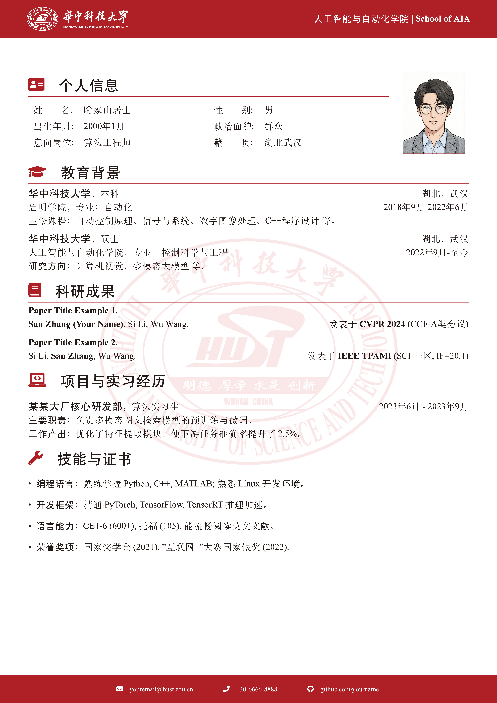

# 华中科技大学 (HUST) 中文简历 LaTeX 模板
这是一个非官方的华中科技大学（HUST）简历 LaTeX 中文模板。基于 [武汉大学简历模板](https://www.overleaf.com/latex/templates/whuwu-han-da-xue-zhong-wen-jian-li-mo-ban/dbkvxrqjmzpd) 二次开发，针对 HUST 进行了配色、校徽和排版逻辑的本地化适配。

## 使用方法 (Usage)

1. **编译环境**：
   - 必须使用 **XeLaTeX** 编译器 (因为涉及到中文和字体处理)。
   - 推荐平台：Overleaf (在线) 或 VS Code + LaTeX Workshop (本地)。

2. **图片准备 (在 `images` 文件夹中)**:
   - `avatar.png`:       你的证件照 (推荐比例 3:4)。
   - `hust_logo.png`:    华科长条校名 Logo (建议白色文字或透明底，显示在页眉左上角)。
   - `hust_badge.png`:   华科圆形校徽 (用于正文中心的透明水印)。

---

## 常见问题 (Q&A)

**Q1: 图标显示不出来，或者想换图标？**
A1: 模板使用了 FontAwesome5 宏包。
    请查阅图标代码表：https://fontawesome.com/v5/search?m=free
    例如 `\faGithub`, `\faEnvelope`, `\faPython` 等。

**Q2: 觉得红色太刺眼，想换回深蓝色？**
A2: 打开 `settings.tex`，找到 `\definecolor{HUST_Red}{RGB}{176, 31, 36}`。
    修改里面的 RGB 数值即可。例如深蓝色是 `{0, 51, 102}`。

---

## 致谢 (Credits & Acknowledgements)

**【饮水思源】**
本模板是一个二次开发版本，其核心代码和设计灵感来源于开源社区的无私贡献。
在此对以下原作者及项目表示最诚挚的感谢：

1. **原型 (Original Base)**:
   武汉大学中文简历模板
   作者：小红书 @虎生

2. **上游基础 (Upstream bases)**:
   本模板的武大版本又是基于以下两个优秀的模板修改而来：
   - 北师大 BNUCV 模板 (GitHub: LeyuDame/BNUCV)
   - 西北工业大学 NPU-CV 模板 (Overleaf: npu-cv)

3. **本次修改 (HUST Adaptation)**:
   将模板本地化为华中科技大学版本，调整了配色、页眉页脚逻辑及字体配置。

---

祝你的简历能助你拿到心仪的 Offer！

**如果本项目对你有帮助，请顺手点个 Star ⭐️ 支持一下！谢谢！**

## License
MIT License
